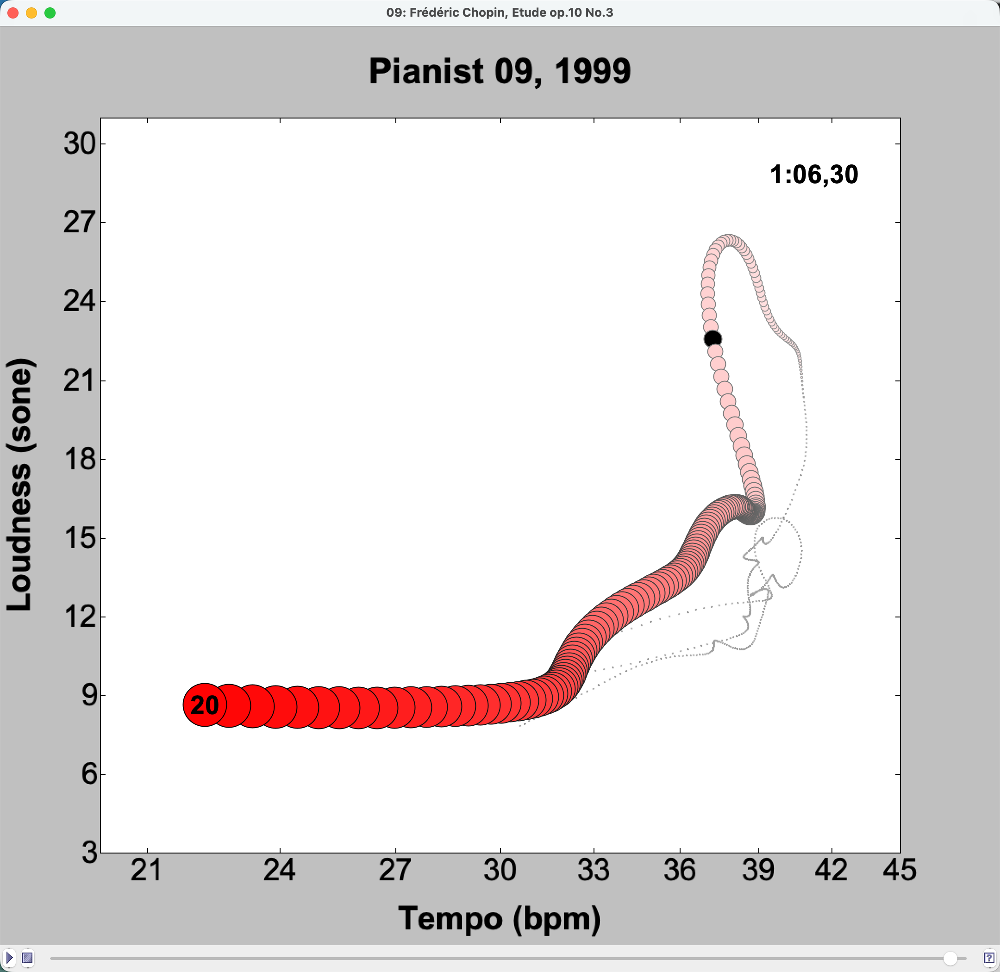

# WormPlay
Interactive player for playing and rendering a Performance Worm from the WormFile format while sounding the hyperlinked audio file. 

<div align="center">
  
</div>

This JAVA application implements the original Performance Worm concept as described in the following papers:

Langner, J., & Goebl, W. (2003). Visualizing expressive performance in tempo–loudness space. Computer Music Journal, 27(4), 69–83. https://doi.org/10.1162/014892603322730514

Dixon, S., Goebl, W., Widmer, G., & Nordahl, M. (2002). The Performance Worm: Real time visualisation based on Langner’s representation. Proceedings of the 2002 International Computer Music Conference, Göteborg, Sweden, San Francisco. http://hdl.handle.net/2027/spo.bbp2372.2002.073


The application is available as a JAR file in the releases section of this repository. The source code is also available for those interested in exploring or modifying the application.

To install, simply download the content of the dist folder including the dist/lib subdirectory. You will additionally need to hav the Java Media Framework (jmf.jar) copied into the dist/lib folder. 

To run the application, cd into the dist folder and type the following command in the terminal:

```
java -jar WormPlay.jar myWormFile.worm -d -150 -s 50
```

This will open the application and load the specified WormFile. The -d and -s options specify the delay of the visual display relative to the audio and the sleep time in milliseconds for the update loop of the application, respectively. Adjust these parameters as needed for optimal performance on your system.

To show the command line options, simply run the application without any arguments:

```
java -jar WormPlay.jar -h
```

To convert the worm file to a series of image files, use the following command:

```java -jar WormPlay.jar myWormFile.worm movie gif```

This will create a series of gif files in the current directory, one for each frame of the worm animation. You can adjust the output format (gif, png, jpg) as needed.

Some example worm files are available in the dist folder for testing the application. You can also create your own worm files using the specifications outlined in [the WORMfile specifications](WORMfileFormat_readme_1.07.txt) or by using any software that can export to the WormFile format. To inspect demo videos of the application, please see https://iwk.mdw.ac.at/goebl/animations/. 


